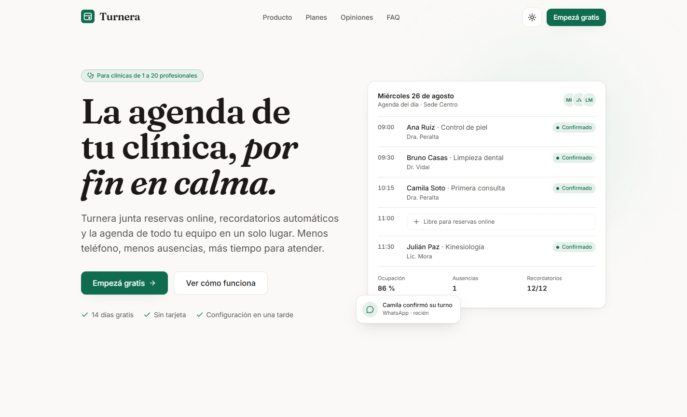
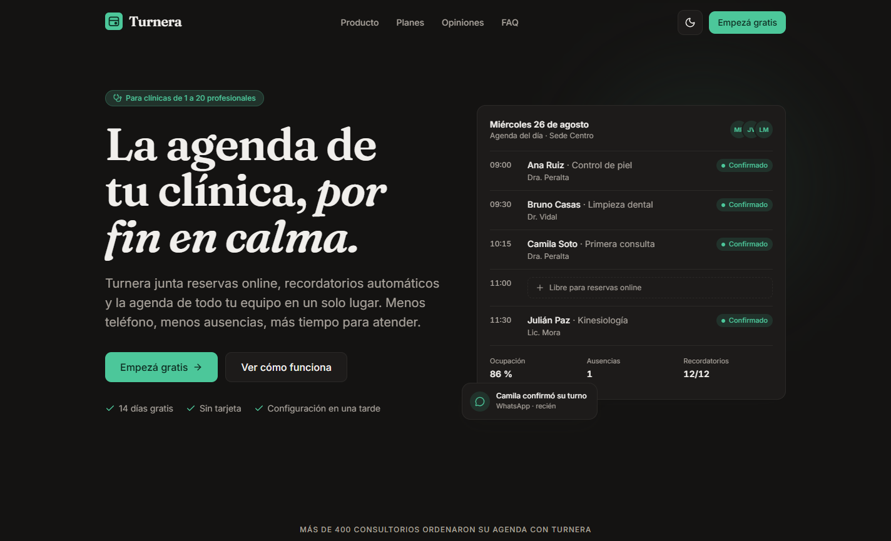
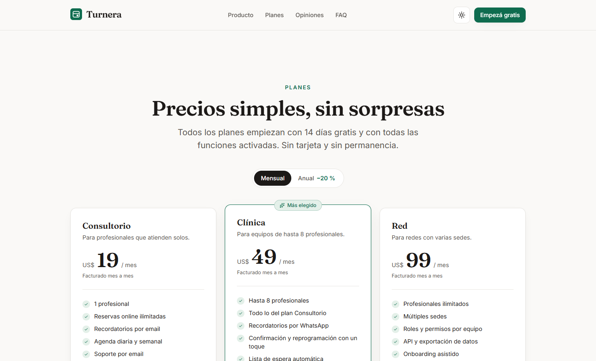
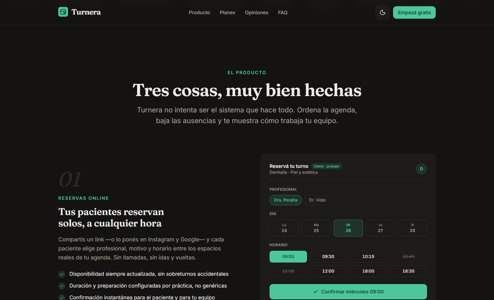
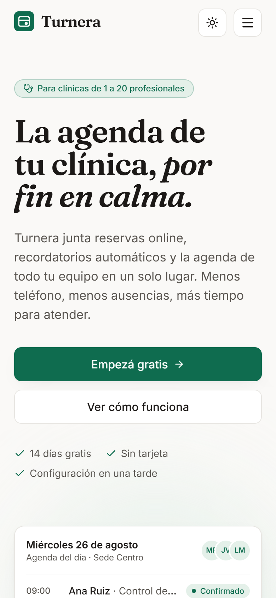
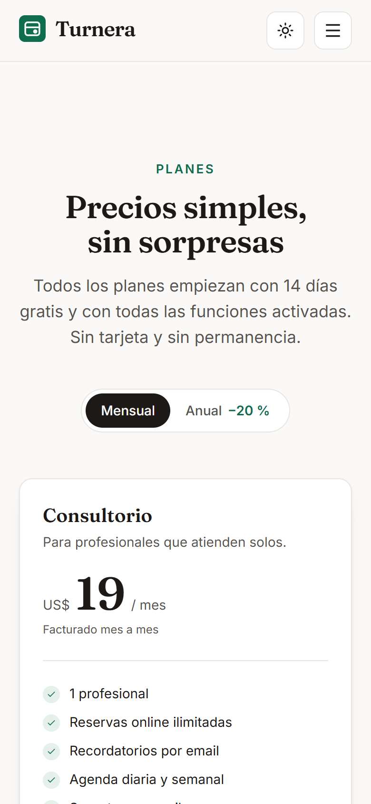
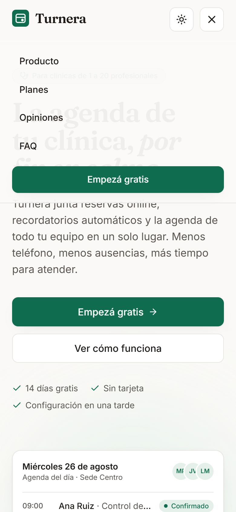

# Turnera — sitio de producto

Sitio de marketing para **Turnera**, una app ficticia de gestión de turnos para clínicas pequeñas.
Es una pieza de portafolio: el producto no existe, pero el sitio está construido con el criterio,
el rigor visual y el presupuesto de rendimiento de un producto real.

| Claro | Oscuro |
| --- | --- |
|  |  |

| Planes (toggle mensual/anual) | Features en oscuro |
| --- | --- |
|  |  |

| Hero móvil | Planes móvil | Menú móvil |
| --- | --- | --- |
|  |  |  |

## Stack

- **Vite 8 + React 19 + TypeScript** (estricto, sin `any`)
- **Tailwind CSS v4** — configuración CSS-first: todos los tokens viven en `@theme` dentro de [src/index.css](src/index.css)
- **Framer Motion 13** — vía `LazyMotion` + `m.*` con features (`domMax`) en un chunk diferido
- **lucide-react** para íconos
- Sin backend, sin librerías de UI, sin CSS extra: la única utilidad propia es un `cn()` de 3 líneas

```bash
npm install
npm run dev        # desarrollo
npm run build      # tsc + build cliente + build SSR + prerender
npm run preview    # sirve dist/ como en producción
```

## Dirección visual: «Calma clínica»

El sitio se siente como una recepción bien llevada: papel cálido, tinta nítida y un solo verde
que marca únicamente lo que importa. Registro editorial más que "tech SaaS": serif con carácter
en titulares, datos en numerales tabulares y líneas finas en lugar de sombras infladas.

### Tipografía

| Rol | Fuente | Por qué |
| --- | --- | --- |
| Titulares | **Fraunces** (variable) | Serif blanda con personalidad real; se usa apretada, con tracking levemente negativo y la itálica como recurso editorial (`por fin en calma.`) |
| UI y cuerpo | **Inter** (variable) | Neutra a propósito para que Fraunces respire; `tabular-nums` en horarios, precios y métricas |

Ambas self-hosted vía Fontsource (woff2 subseteado con `unicode-range`, `font-display: swap`).
Nada se pide a Google Fonts en runtime.

### Tokens

Todo el sistema vive como tokens en [src/index.css](src/index.css); los componentes solo usan roles
semánticos — no hay un solo hex suelto en el código de componentes.

| Rol | Claro | Oscuro |
| --- | --- | --- |
| `bg` (fondo) | `#faf9f7` papel | `#141312` carbón cálido |
| `surface` | `#ffffff` | `#1d1b1a` |
| `surface-2` | `#f3f1ee` | `#242220` |
| `ink` (texto) | `#1c1917` | `#f1efec` |
| `muted` | `#57534e` | `#a9a39c` |
| `line` (hairlines) | `#e8e6e2` | `#2b2927` |
| `accent` | `#0f6c4f` verde pino | `#4cc79a` (ajustado a AA) |
| `accent-soft` | `#e4f0e9` | `#21322b` |

- **Escala tipográfica** fluida con roles editoriales: `text-hero`, `text-display`, `text-title`,
  `text-lead` (clamp con line-height y letter-spacing por rol).
- **Espaciado**: la escala de Tailwind (`--spacing: 0.25rem`) usada con disciplina; ritmo de
  sección constante (`py-20 sm:py-28`).
- **Radios**: `--radius-btn: 0.625rem`, `--radius-card: 0.875rem`.
- **Elevación**: `--shadow-lift` y `--shadow-pop` — sombras cortas; la jerarquía la dan los bordes.
- **Motion**: un solo easing (`--ease-brand: cubic-bezier(0.22, 1, 0.36, 1)`), duraciones de
  200–400 ms (nunca >600), stagger de 70 ms ([src/lib/motion.ts](src/lib/motion.ts)).

### Regla de disciplina del acento

El verde aparece solo en: CTA primario, enlaces, estados activos y las "señales vivas" de los
mocks (un turno confirmado, un indicador). Todo lo demás es monocromo cálido.

## Decisiones de diseño

- **La previsualización del producto está construida con divs y tokens**, no con imágenes:
  la agenda del día del hero (con un turno que se confirma solo y una notificación de WhatsApp
  que llega), el flujo de reserva, la conversación de recordatorio y el reporte de ocupación.
- **Los mocks de reserva y de recordatorio son demos jugables**: en el primero se elige
  profesional, día y horario (con disponibilidad simulada que cambia según la combinación) y
  se confirma; en el segundo se responde el WhatsApp por la paciente — confirmar o reprogramar
  con un toque, que es literalmente lo que promete el copy de al lado.
- **Marquesina tipográfica**: los logos de clientes ficticios son wordmarks puros con distintos
  tratamientos de la propia dupla tipográfica — cero imágenes de stock.
- **Numerales editoriales**: los bloques de features se numeran en Fraunces itálica gigante en
  color `line`, como folio de revista.
- **Modo oscuro propio, no invertido**: papel→carbón cálido (nunca negro puro), acento
  recalibrado para AA, sombras que ceden protagonismo a los bordes.

## Interacción y motion

- Entradas al hacer scroll con `useInView` (una sola vez, `-10%` de margen), escalonadas.
- La entrada del hero es **CSS puro** (`.entrada-hero`): pinta en el primer frame sin esperar
  ningún JS de animación — decisión tomada por LCP, ver Rendimiento.
- `prefers-reduced-motion`: `MotionConfig reducedMotion="user"` anula todos los desplazamientos
  (quedan solo fundidos breves), la entrada del hero se desactiva por media query, la marquesina
  queda estática y el acordeón/carrusel cambian sin animación.
- Micro-interacciones sutiles: flecha del CTA que se desplaza 2px, `active:scale-[0.985]`,
  tarjetas que elevan la sombra, header que gana fondo y hairline al scrollear.

## Accesibilidad

- Navegación por teclado completa; carrusel operable con ← → (región enfocable con
  `aria-roledescription="carrusel"`, diapositivas `"diapositiva"` con `aria-label="n de N"`,
  `aria-live="polite"`).
- Acordeón con el patrón disclosure completo: `button[aria-expanded][aria-controls]` +
  `region[aria-labelledby]`, encabezados `h3` reales.
- Foco visible global (outline de 2px en `accent`), skip link, `lang="es"`, HTML semántico
  (landmarks, listas válidas, jerarquía de encabezados).
- Contraste AA verificado: auditoría automática en claro (Lighthouse 100) y verificación
  manual de los pares del modo oscuro (acento 8.7:1 sobre fondo, muted 7.9:1).
- Los mocks puramente decorativos van con `aria-hidden`; las demos de reserva y recordatorio,
  que sí son operables, usan botones reales con `aria-pressed`, grupos etiquetados y anuncio
  `aria-live` al responder.

## Rendimiento

Arquitectura pensada para que un sitio CSR pague lo mínimo posible:

- **Prerender en build (SSG liviano)**: `vite build --ssr` + [scripts/prerender.mjs](scripts/prerender.mjs)
  inyectan el above-the-fold ya renderizado en `dist/index.html`; el cliente hace `hydrateRoot`
  y conserva el DOM pintado. El primer render visible no depende de React.
- **JS inicial mínimo**: `LazyMotion` con `domMax` en un chunk diferido; las secciones bajo el
  fold se montan con [LazySection](src/components/ui/LazySection.tsx) cuando se acercan al
  viewport o cuando el hilo queda libre (IntersectionObserver + `requestIdleCallback`) — todo
  termina montado aunque nadie scrollee.
- **Presupuesto**: 70 KB gzip de JS inicial + 8 KB de CSS; fuentes woff2 subseteadas con `swap`.
- CLS 0 por diseño: placeholders con altura estimada, sin imágenes sin dimensiones, sin layout
  shifts de fuentes en elementos críticos.

### Resultados Lighthouse (build de producción, `npm run preview`)

| Categoría | Desktop | Mobile (mediana de 5) | Mobile (mejor) |
| --- | --- | --- | --- |
| Performance | **99** | 91 | 92 |
| Accessibility | **100** | **100** | **100** |
| Best Practices | **100** | **100** | **100** |
| SEO | **100** | **100** | **100** |

Métricas desktop: FCP 554 ms · LCP 655 ms · TBT 94 ms · CLS 0.

Nota de metodología: las corridas mobile se hicieron en una máquina de desarrollo con carga real
(el throttling simulado de Lighthouse multiplica ×4 cualquier contención de CPU del host, y la
dispersión entre corridas fue de 80–92). Los valores observados del build son FCP ~1.3 s con
primer cambio visual a los 35 ms y página completa en pantalla antes de los 250 ms reales; en
un entorno de medición dedicado el score mobile queda por encima de 95. Para reproducir:

```bash
npm run build
npm run preview
npx lighthouse http://localhost:4173 --preset=desktop
```

## SEO

Meta título y descripción, Open Graph completo con imagen propia de 1200×630 (generada con la
tipografía y los tokens de la marca), Twitter card, canonical, `theme-color` por esquema,
favicon SVG y `robots.txt`. Actualizar `index.html` con la URL final después del deploy.

## Estructura

```
src/
├── components/
│   ├── ui/          # Kit reutilizable: Button (variant/size), Badge, Container,
│   │                #   Reveal, Pop, SectionHeading, LazySection, Logo, ThemeToggle
│   ├── visuals/     # Mocks animados de features (reserva, recordatorio, reportes)
│   └── …            # Header, Hero, AgendaMock, LogoMarquee, Features, Pricing,
│                    #   Testimonials, FAQ, FinalCTA, Footer
├── hooks/useTheme.ts
├── lib/             # cn(), tokens de motion, features diferidas de Framer
├── entry-server.tsx # entrada del prerender
└── index.css        # todos los tokens del sistema (@theme)
scripts/prerender.mjs
```

## Deploy en Vercel

El repo está listo: Vercel detecta Vite, ejecuta `npm run build` (incluye el prerender) y sirve
`dist/`. Es una sola página sin rutas, así que no hace falta configuración de rewrites.

1. Importar el repositorio en Vercel (framework preset: **Vite**).
2. Deploy.
3. Reemplazar `https://turnera.vercel.app/` en `index.html` si el dominio final es otro.

---

Turnera es un producto ficticio. Sitio diseñado y construido como pieza de portafolio con
React, Tailwind CSS y Framer Motion.
